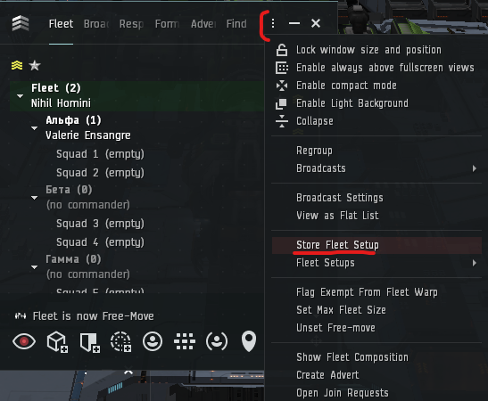
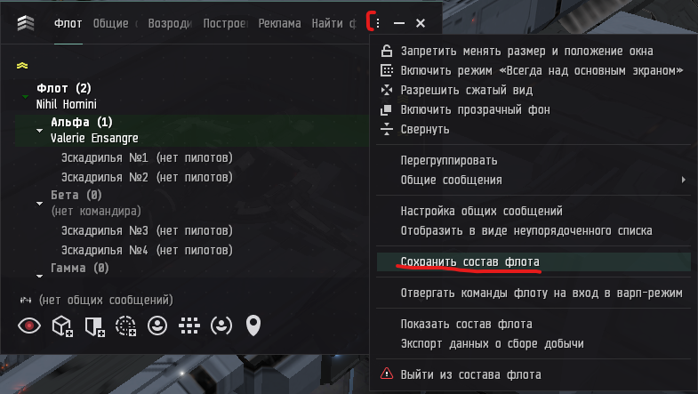
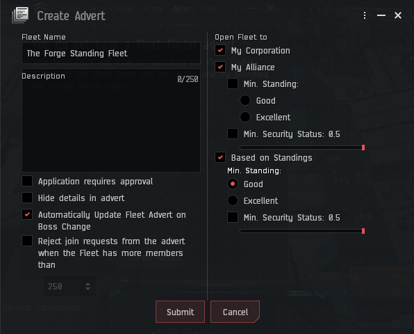

# Поднятие флота

Вы зашли утром или после ДТ и стандартный standing флот ещё не поднят? Ничто не мешает вам создать флот самостоятельно!

> Важный момент - у альянсов могут отличаться настройки стендингов,
> так что рекомендуется поднимать флот персонажам находящимся в основе.
> (актуально, когда у вас есть альто-корпы/академки)

0. **Какой вообще флот? Зачем и как туда вступать?**
    
    Большинство коллективов проживающих в определённом месте 
    совместно с заплюсованными соседями создают Standing флоты.
    Такие флоты упрощают идентификацию свой/чужой и позволяют 
    в случае опасности наварпать на союзника.
    Поэтому очень желательно всегда (за редкими исключениями)
    находиться в стендинг флоте во время игры.

    > Не исключена возможность выдачи типа вашего корабля 
    > и его местоположения и последующего плюсотакла по наварпу,
    > так что если вы на чём-то дорогом (дред/мазер/фура) -
    > входить в большой местный стендинг флот может стать ошибкой, 
    > оценивайте риски сами или уточните у более опытных пилотов.

    Такие флоты всегда опубликованы (доступны в поиске флотов)
    и имеют вход ограниченный стендингом. Если вы не знаете,
    существует ли у вас что-то подобное - уточните у сокорпов.

    Чтобы вступить - откройте меню `NeoCom -> Social -> Fleet` 
    (`Неоком -> Общение -> Штаб Флота`)

    В открывшемся окне перейдите на вкладку `Fleet Finder` 
    (`Поиск Флотов`), найдите в списке нужный флот, нажмите на него
    и затем нажмите `Join Fleet` (`Присоединиться к флоту`)

1. **Тырим настройки флота**

    Т.к. настройки флота могут отличаться от коллектива к коллективу -
    в первый раз проще будет дождаться когда флот поднимет кто-то у кого настройки сохранены. После этого вступаем во флот, открываем меню флота и выбираем `Store Fleet Setup` (`Сохранить состав флота`)

    

    

    Отмечаем в открывшемся окне все галки и выбираем название флота

2. **Создаём флот**

    Нужные настройки есть, зашли после ДТ и никто ещё флот не поднял -
    самое время сделать это самостоятельно.

    Открываем окно флота, на первой же вкладке `Fleet` (`Штаб Флота`)
    внизу, рядом с кнопкой `Form Fleet` (`Создать флот`) разворачиваем
    выпадающий список и выбираем сохранённые ранее настройки флота.
    Нажимаем `Form Fleet` (`Создать флот`). 
    
    Флот создан, теперь нужно сделать его доступным для остальных.
    Переходим на вкладку `Advert` (`Реклама`), нажимаем `Create Advert`
    (`Создать объявление`). 
    Дальше настройки могут различаться от коллектива к коллективу,
    уточните настройки если не уверены как выставлять.

    

    
    
    Настроили, жмём `Submit` (`Отправить`).

    Поздравляю, вы великолепны!

    
