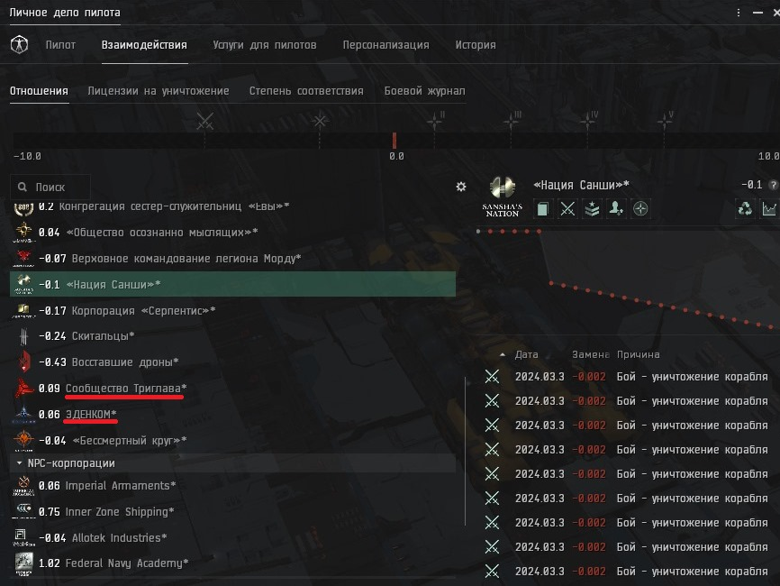

# Salvaging
Для того что бы начать сальважить вам необходимо определится где. 
Один из примеров **Пространсво Триглава**
##  Легкие деньги и не дорого 
Перед тем что бы туда идти выполним эти пункты 
##            Репутация.

1.      Нам нужно поднять отношение с двумя фракциями
###    **Сообщество Триглава**
###    **Эденком**


Поднятие репутации достаточно до **0.01**
Простой способ купить корабль найти нпс враждебную которая сражается с отдной из этих организаций. 
Пострелять по нпс враждебной и репутация поднимится.


##            Корабль.

<details>
  <summary style="font-size: 20px;">Нажмите что увидеть фит</summary>

  ```js
    [Heron, *Heron]
Inertial Stabilizers I
Inertial Stabilizers I

5MN Quad LiF Restrained Microwarpdrive
Small Compact Pb-Acid Cap Battery
Small Shield Extender I
Small Shield Extender I
Small Shield Extender I

Salvager I
Salvager I
Salvager I

Small Salvage Tackle I
Small Salvage Tackle I
Small Salvage Tackle I
  ```
</details>

##            Где будет происходить.
3. 