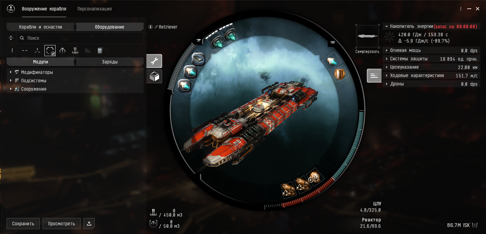
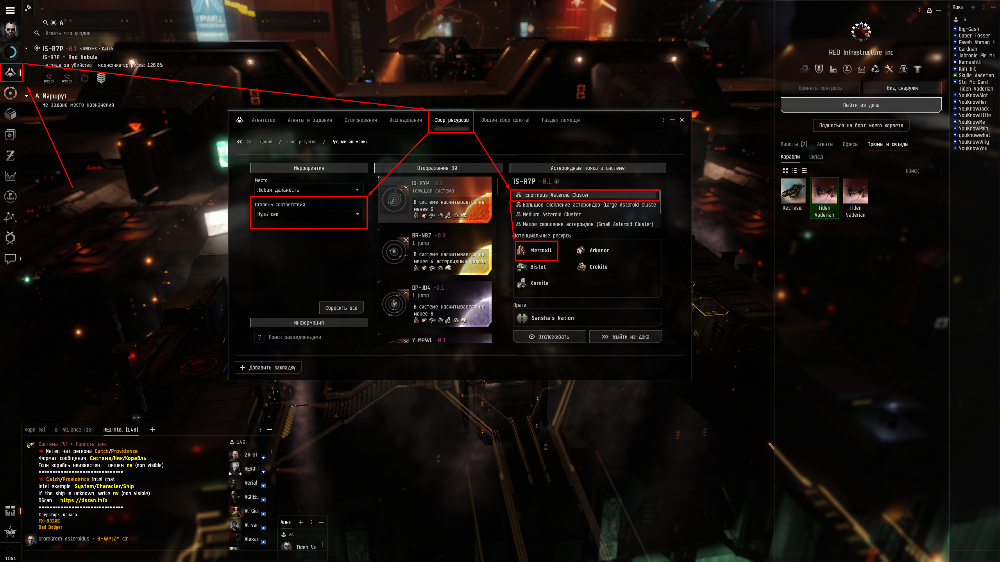
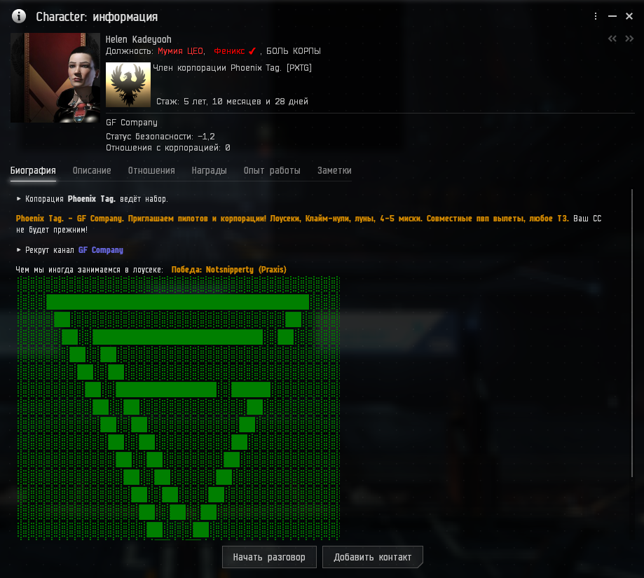
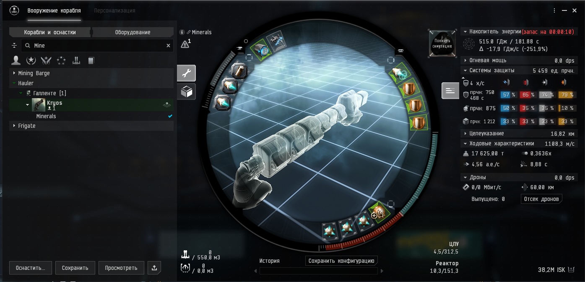
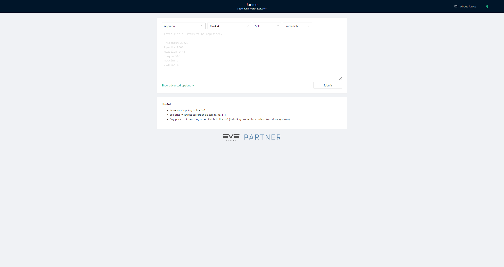
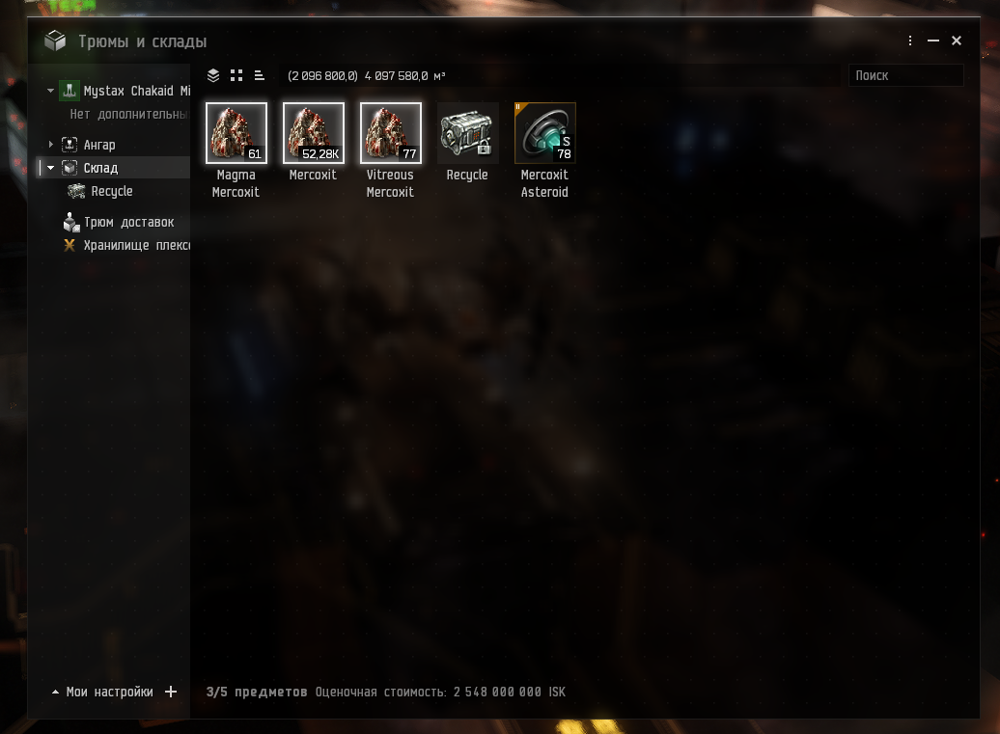
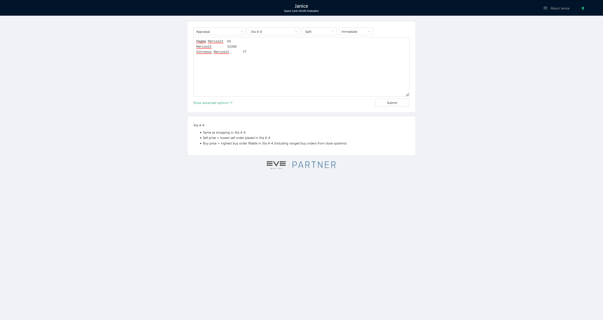
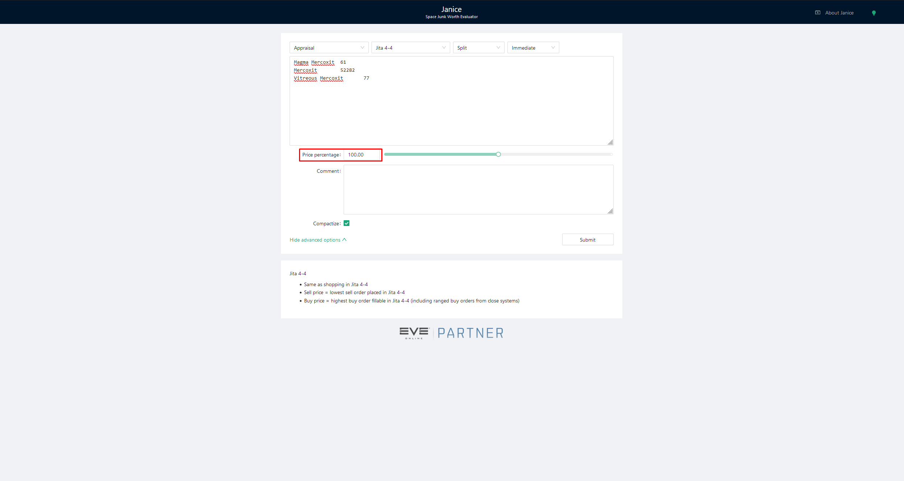
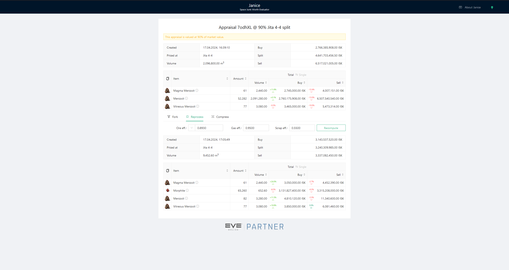

## Пролог

**Здесь будет описано про более продвинутый манинг.** <br/>
**Подходы описаные здесь не особо подходять для новичков.** <br/>
**Но возможно вам станет понятнее к чему можно стремится.**

## Что и где можно копать

Первое что нужно в нашем случае понять это где конкретно в нашем альянсе находится "центр" переработки сырья.

### Меркоцид

Казалось бы все просто для каждого аккаунта что будет копать учим необхожимые для этого навыки покупаем кораблик ищем аномалии и копаем, но.

В нашем случае "центр" переработки сырья это станция Tatara **IS-R7P - Red Nebula** в системе **IS-R7P**

#### Фит

Для начала копания меркоцита я предлагаю использовать Retriever в следующем фите



<details>
  <summary style="font-size: 20px;">Нажмите что увидеть фит</summary>

  ```js
    [Retriever, *Retriever]
    Warp Core Stabilizer I
    Mining Laser Upgrade II
    Mining Laser Upgrade II

    10MN Afterburner II
    Multispectrum Shield Hardener II

    Modulated Deep Core Strip Miner II
    Modulated Deep Core Strip Miner II

    Medium Low Friction Nozzle Joints I
    Medium Polycarbon Engine Housing I
    Medium Mercoxit Mining Crystal Optimization I

    Mercoxit Asteroid Mining Crystal Type A II x2
  ```
</details>

### Поиск аномалий

Я советую сначала искать аномалии используя капсулу сохранять кординаты в папку и только после этого начинать копать.

> **Важно: Камни меркоцита когда их копают выпускают облако газ радиусом 6км что дамажит так что приварпивать к вамню нужно в 10 км.**

 1. Прилетаем в систему где находится переработка открываем окно агенства и смотрим что есть по близости.

    Агенство > Сбор ресурсов > Рудные аномалии

    

2. Строим маршрут по ситстемам что находтся макисмум в 3-х прижках от нашего "центра" переработки и имеют много аномалий.

3. Используя шатл летим по маршруту и проверяем каждую аномалию где написано что есть Меркоцид. <br/>
    Если находим сохраняем кординаты каждого камня в папку и лети дальше.  <br/>
    Мне нравится дописывать в названия кординат цифры 1.1, 1.2, где первая цифра это номер аномалии что я нашел а второй это номер камня (нумерация на ваше усмотрение).<br/>

    > **Важно: Аномалии с названиями "Маленькая/Средняя/Большая залеж меркоцида" чаще всего будут охранятся нпс. Поэтому их сначала нужно будет зачистить или игнорировать.**

4. Берем лопаты, варпаем по зарание сохраненым кординатам и копаем. <br/>

Очень важно понимать что в EVE не бывает безопасного AFK фарма. <br/>
Поэтому не стоит оставлять ваши лопаты без присмотра. <br/>
По прилету на аномалию хорошей идеей будет развернуть кораблик в сторону того места куда вы хотите отварпать в случае опасности.<br/>
Все предосторожности занимают довольно моного времени но тут уже каждый решает готов ли он потерять 100кк Isk + накопаное потому что ему было лень сделать подготовку.

При появлении в системе нетрала или врага лучше не рисковать и сразу начинать отварп на станцию.

Так же меркоцит может сжимать минимум орка а он очень обьемный поэтому я предлагаю в каждой системе всеми лопатами скидывать накопаное в одну станку и после окончания копки передать все одному перонажу что займется перевозкой всего накопаного в "центр" переработки.

> Дальше смотрите пункт [Что делать с рудой](#ore-what-to-do).

### Копка аномалий

-----

### Копка Лун

-----

<a id="ore-what-to-do"></a>

## Что делать с рудой

**Вы уже закончили копать и перевезли все на переработчик?**

> Теперь вы должны оплатить налог **5%** накопаного для рудных аномалий и **15%** если вы копаете корпаративные луны.

Просто отделяем **5%** или **15%** руды соответствено и составляем контракт без цены в нашем случае на Helen Kadeyooh.



> Если вы не из GFC то узнайте у своего CEO проценты и на кого составлять контракт.

После оплаты налога остальные ресерсы полностью ваши. 

-----
 
Один из вариантов что делать дальше это  перерабоать руду и отвезти на продажу самомостотельно. <br/>
Для начала необходимо найти человека что сможет вам перебоать руду не теря много процентов на переработке.<br/>
Можно выучить необходимые навыки самому или связатся в случае нашего Альянса с **@veydi** или **@agihammerthief** в дискорде.

После переработки грузите полученые ресурсы в грузовичек и везете продавать.

Переработный меркоцид занимает довольно мало места его можно возить даже на 2-х секундном санезисе.

А вот другие ресурсы лучше вcего воить на **Kryos**: 



<details>
  <summary style="font-size: 20px;">Нажмите что увидеть фит</summary>

  ```js
    [Kryos, Minerals]
    Warp Core Stabilizer II
    Inertial Stabilizers II
    Inertial Stabilizers II
    Inertial Stabilizers II

    50MN Y-T8 Compact Microwarpdrive
    Multispectrum Shield Hardener II
    Multispectrum Shield Hardener II
    Multispectrum Shield Hardener II

    Interdiction Nullifier I
    Improved Cloaking Device II

    Medium Hyperspatial Velocity Optimizer II
    Medium Hyperspatial Velocity Optimizer II
    Medium Ancillary Current Router I
  ```
</details>

Иногда бывают ситуации когда сжатый ресурс вестит сильно меньше чем минерали что из него получатся а стоит примерно так же. 

Тогда не плохим вариантом будет возить и продавать просто сжатый ресурс без переработки.

> Cмотрите пункт [Цена накопаного](#how-much-cost) что б понять куда стоит везти. 

-----

Другой вариант это продавать руду альнсу

Для этого необходимо составить конктракт на Helen Kadeyooh

Где в поле "Я получу" установить цену что отображена в **https://janice.e-351.com/** и добавить ссылку на результат **janice** как коментарий к контракту.

**Helen Kadeyooh** покупает руду по цене **-10%** по Jita buy. 

> Подробнее тут: [Цена накопаного](#how-much-cost).


> Если вы не из GFC то узнайте у своего CEO проценты и на кого составлять контракт.

<a id="how-much-cost"></a>

## Цена накопаного

Для того чтоб узнать цену мы используем сайт [https://janice.e-351.com/](https://janice.e-351.com/)



Для начала открываем хранилище, выделяем что хотим продать и нажимаем CTRL + C.



После этого переходим на janice и в самом болшом поле нажымаем CTRL + V.



Чтоб настроить расчёт более точно чуть ниже основоного поля нужно нажать кнопку "Show advanced options".

Именно здесь устанавливается процент когда говорять -10% по Jita buy например.

Тут нужно устнаовит процент что вам сказали, для руд если покупает Helen Kadeyooh это -10% тоесть в это поле вводим значение 90 и нажимаем кнопку Submit.



Уже на этом этапе виднен так называемый Buy слева сверху.

Но мы продаем руду а её можно переработать так что выбераем пункт "Reprocess"

В поле "Ore eff." устанавливаем значения: 
 - **0.872** для меркоцита или обычных руд.
 - **0.793** для лунных руд.

После чего нажимаем кнопку "Recompute".

Немного ниже этой кнопки увидим цену минералов что получатся из вашей руды, вот её то и нужно указать в контракте.



> Если вы уже переработали руду и хотите продать минералы то пункт "Reprocess" вы пропускаете и цена будет указана сверху в поле Buy.

> Если вернутся на главную страницу janice или перейти в пункт "Fork" то вы увидте поля где можно указать системы где вы планируете продавать.